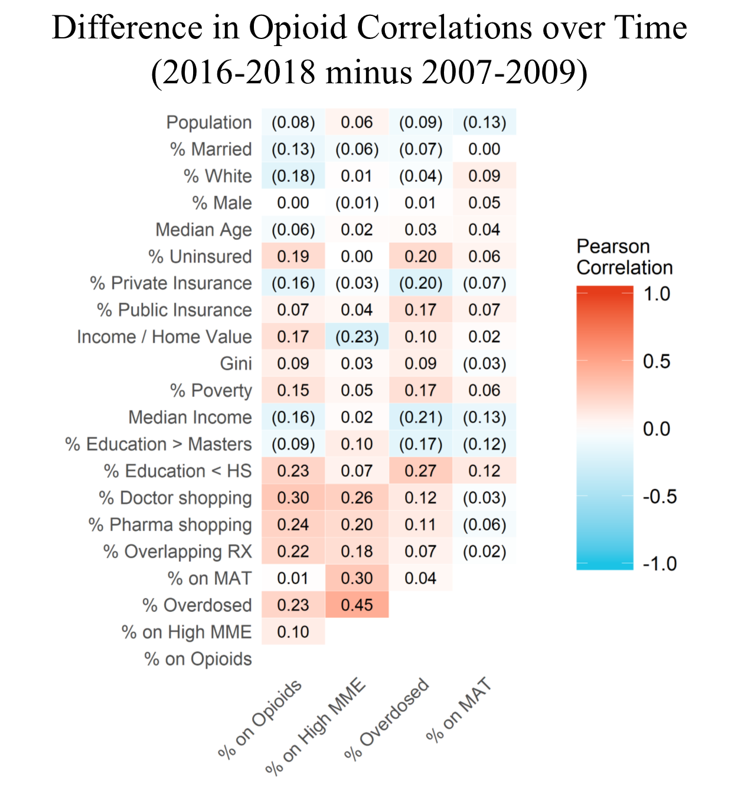

MAT vs Opioid (US)
=====

  

About
-----
This repository was written in 2019. It uses the Washington Posts' version of the Automation of Reports and Consolidated Orders System (ARCOS) (titled by WaPo: "The DEA Database"), the American Community Survey, and a private insurance dataset to track the relationship between opioid pill supply and use of medical assisted therapies (MAT) in treating opioid addiction. In particular, this repository focuses on changes in demographic associations with opioid/MAT use over time.